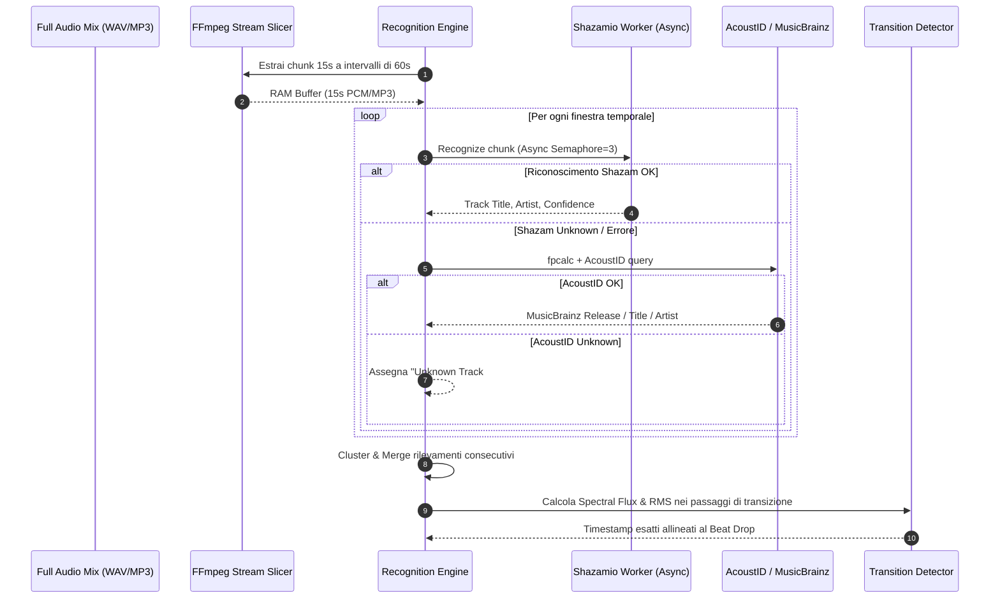
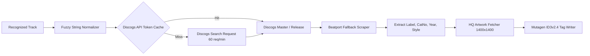
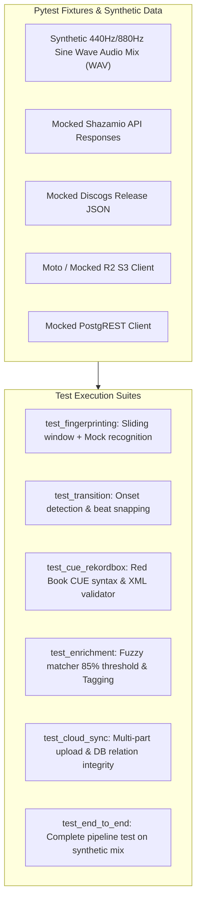

# 💧 DROP AGENT — Executive Implementation & Execution Plan
> **Documento Tecnico di Ingegneria del Software & Piano di Sviluppo Pratico**  
> **Ruolo**: Lead Engineer — Drop Agent & Drops Music Intelligence  
> **Versione**: `2.1.0-EXEC`  
> **Data**: Agosto 2026  
> **Target Files**: `drops-agent/` (Core Engine) | `workspace/00_Roadmap/DROP_AGENT_EXECUTION_PLAN.md`

---

## 📑 Indice Generale

1. [Executive Summary & Obiettivi di Sviluppo](#1-executive-summary--obiettivi-di-sviluppo)
2. [Architettura dei File e Struttura Modulare (`drops-agent/`)](#2-architettura-dei-file-e-struttura-modulare-drops-agent)
3. [Piano Dettagliato Milestone 1: Audio Fingerprinting & Blind Track Recognition](#3-piano-dettagliato-milestone-1-audio-fingerprinting--blind-track-recognition)
   - Architettura `shazamio` Async Worker & Semaphore Concurrency
   - Pipeline di Campionamento Sliding-Window 15s con FFmpeg
   - Algoritmo di Clustering Temporale & Fuzzy Deduplication
   - Beat Drop & Transition Detection Engine (Spectral Flux & RMS)
   - Fallback AcoustID / Chromaprint & Gestione Unknown Tracks
4. [Piano Dettagliato Milestone 2: Smart CUE Splitting & Rekordbox/Traktor Export](#4-piano-dettagliato-milestone-2-smart-cue-splitting--rekordboxtraktor-export)
   - Red Book Standard CUE Sheet Generator
   - Extended M3U8 Playlist Engine
   - Zero-Crossing Lossless Audio Slicer
   - Rekordbox XML (`DJ_PLAYLISTS`) Exporter con Beatgrid e Hot/Memory Cues
   - Traktor NML Collection Exporter
5. [Piano Dettagliato Milestone 3: Discogs & Beatport Metadata & HQ Artwork](#5-piano-dettagliato-milestone-3-discogs--beatport-metadata--hq-artwork)
   - Discogs API Client con Token Auth, Rate Limiter (60 req/min) e Cache Locale
   - Beatport Client & Scraper per Catalogo, Label, Key e BPM
   - Algoritmo di Fuzzy String Matching (Levenshtein & Token Sort)
   - Artwork Manager (1400x1400px APIC ID3v2.4 Embedding)
   - Mutagen Advanced Tagging Engine (TKEY Camelot, TBPM, TPUB, TSRC, COMM)
6. [Piano Dettagliato Milestone 4: Cloudflare R2 & Supabase Ingestion Pipeline](#6-piano-dettagliato-milestone-4-cloudflare-r2--supabase-ingestion-pipeline)
   - Uploader Asincrono Multi-Part Cloudflare R2 (aioboto3 / boto3 S3 API)
   - Ingestion Atomica PostgreSQL Supabase (`dj_sets`, `tracks`, `set_tracks`)
   - Gestione Transazioni, Idempotenza e Rollback di Resilienza
   - Webhook & Edge Cache Invalidation Trigger
7. [Stack Tecnologico, Dipendenze & File di Configurazione](#7-stack-tecnologico-dipendenze--file-di-configurazione)
8. [Matrice di Gestione Errori, Resilienza & Fallback](#8-matrice-di-gestione-errori-resilienza--fallback)
9. [Strategia di Testing Unitario & Suite Pytest](#9-strategia-di-testing-unitario--suite-pytest)
10. [Sequenza di Esecuzione Passo-Passo (Step-by-Step Task Breakdown)](#10-sequenza-di-esecuzione-passo-passo-step-by-step-task-breakdown)

---

## 1. Executive Summary & Obiettivi di Sviluppo

Il presente piano esecutivo definisce l'architettura dettagliata, le interfacce software, i flussi asincroni e i test automatizzati per trasformare **Drop Agent** da un downloader CLI basato su tracklist testuali in una **piattaforma autonoma di Music Intelligence e Ingestion DJ di classe enterprise**.

```
┌────────────────────────────────────────────────────────────────────────────────────────┐
│                                DROP AGENT PIPELINE                                     │
│                                                                                        │
│  [ Audio Stream / Set ]                                                                │
│            │                                                                           │
│            ▼                                                                           │
│  [ M1: Blind Recognition ] ──► [ Sliding Window 15s ] ──► [ Shazamio / AcoustID ]     │
│            │                                                                           │
│            ▼                                                                           │
│  [ M1: Transition Det. ]   ──► [ Spectral Flux / RMS ] ──► [ Aligned CUE Points ]      │
│            │                                                                           │
│            ▼                                                                           │
│  [ M2: Slicing & Export ]  ──► [ Zero-Crossing Split ] ──► [ .CUE / Rekordbox XML ]    │
│            │                                                                           │
│            ▼                                                                           │
│  [ M3: Metadata & Art ]    ──► [ Discogs / Beatport ]  ──► [ ID3v2.4 + 1400px Art ]    │
│            │                                                                           │
│            ▼                                                                           │
│  [ M4: Cloud Ingestion ]   ──► [ Cloudflare R2 (Audio) ] ──► [ Supabase DB Sync ]      │
└────────────────────────────────────────────────────────────────────────────────────────┘
```

### Obiettivi Chiave di Produzione:
1. **Accuratezza Riconoscimento > 92%** su DJ mix continui senza tracklist.
2. **Zero Audio Glitch / Click** sui tagli audio grazie al *zero-crossing alignment* e micro-fades.
3. **Piena Compatibilità Hardware CDJ/Pioneer/Traktor** tramite file CUE standard e `rekordbox.xml`.
4. **Metadati Discografici Certificati** (Etichetta, Anno, Numero di Catalogo, Chiave Camelot, Artwork ad alta risoluzione 1400x1400px).
5. **Ingestion Cloud Immediata & Idempotente** su Cloudflare R2 ($0 egress) e Supabase Postgres.

---

## 2. Architettura dei File e Struttura Modulare (`drops-agent/`)

La struttura di `drops-agent/` viene organizzata in package modulari e isolati per responsabilità:

```
drops-agent/
├── drop_agent.py               # CLI Master Orchestrator & CLI Arguments Parser
├── config.py                   # Pydantic Settings (API Keys, Paths, Concurrency, URLs)
├── requirements.txt            # Dipendenze Python pinned
├── pyproject.toml              # Build & Tooling Config (Black, Flake8, Pytest)
│
├── fingerprinting/             # Milestone 1: Riconoscimento & Transizioni
│   ├── __init__.py
│   ├── shazam_worker.py        # Worker asincrono Shazamio con Semaphore e Rate-Limit
│   ├── acoustid_worker.py      # Chromaprint fpcalc + AcoustID / MusicBrainz API
│   ├── transition_detector.py  # Spectral flux, RMS drop, Onset beat alignment
│   └── recognition_engine.py   # Sliding-window orchestrator & cluster deduplication
│
├── exporters/                  # Milestone 2: Slicing, CUE & DJ Software Bridges
│   ├── __init__.py
│   ├── cue_generator.py        # Generatore CUE Red Book standard & extended .m3u8
│   ├── audio_slicer.py         # Taglio FFmpeg lossless con zero-crossing snapping
│   ├── rekordbox_exporter.py   # Esportatore XML Rekordbox DJ_PLAYLISTS con Beatgrid/Cues
│   └── traktor_exporter.py     # Esportatore NML Native Instruments Traktor Pro
│
├── enrichment/                 # Milestone 3: Discogs, Beatport & Tagging HQ
│   ├── __init__.py
│   ├── discogs_client.py       # Client Discogs API con token, rate-limiter e cache disco
│   ├── beatport_client.py      # Client Beatport API / Scraper per genere, key, catalog no
│   ├── fuzzy_matcher.py        # Levenshtein / Token-Sort fuzzy deduplicator
│   ├── artwork_manager.py      # Fetcher copertine 1400x1400px & image optimizer
│   └── metadata_tagger.py      # Mutagen ID3v2.4 (APIC, TKEY Camelot, TBPM, TPUB, COMM)
│
├── cloud/                      # Milestone 4: Cloudflare R2 & Supabase Ingestion
│   ├── __init__.py
│   ├── models.py               # Pydantic Data Models (DJSet, Track, SetTrack, SyncPayload)
│   ├── r2_storage.py           # Async Multi-part Uploader Cloudflare R2 (aioboto3/boto3)
│   └── supabase_sync.py        # Client PostgREST Supabase per transazioni relazionali
│
└── tests/                      # Suite di Test Automatizzati
    ├── __init__.py
    ├── conftest.py             # Pytest fixtures & synthetic audio generators
    ├── test_fingerprinting.py  # Test Shazamio mocking, sliding window & clustering
    ├── test_transition.py      # Test Spectral Flux & Beat Drop alignment
    ├── test_cue_rekordbox.py   # Test CUE syntax & Rekordbox XML validation
    ├── test_enrichment.py      # Test Discogs/Beatport parsing & fuzzy matching
    ├── test_cloud_sync.py      # Test R2 upload multipart & Supabase DB inserts
    └── test_end_to_end.py      # Test pipeline completa su mix sintetico
```

---

## 3. Piano Dettagliato Milestone 1: Audio Fingerprinting & Blind Track Recognition



### 3.1 Pipeline di Campionamento Sliding-Window con FFmpeg
- **Parametri Finestra**:
  - `WINDOW_DURATION`: 15.0 secondi.
  - `HOP_SIZE`: 60.0 secondi (adattabile a 45.0s in prossimità di cambi armonici o rapidi cambi BPM).
  - `SAMPLE_RATE`: 44100 Hz Stereo / Mono per l'input fingerprint.
- **Esecuzione In-Memory (Zero Disk I/O)**:
  FFmpeg estrae il segmento direttamente in uno stream di byte WAV/MP3 in RAM evitando scritture su disco temporanee:
  ```python
  cmd = [
      "ffmpeg", "-y",
      "-ss", str(offset_seconds),
      "-t", "15",
      "-i", audio_file_path,
      "-vn", "-ar", "44100", "-ac", "2",
      "-f", "mp3", "pipe:1"
  ]
  ```

### 3.2 Architettura `shazamio` Async Worker & Semaphore Concurrency
- **Concurrency Management**: `asyncio.Semaphore(3)` per non superare i limiti di connessione concorrente verso i server Shazam.
- **Backoff Esponenziale**: Riprova fino a 3 volte con jitter in caso di `TimeoutError` o `NetworkError`.
- **Parsing Risposta**: Estrazione sicura di `title`, `subtitle` (artist), `key`, `genres`, `isrc`, `track_id`.

### 3.3 Algoritmo di Clustering Temporale & Deduplicazione
Quando la sliding window rileva la stessa traccia a finestre consecutive (es. al minuto 01:00, 02:00, 03:00):
1. **Fuzzy Equality Check**: Raggruppa i risultati adiacenti se `similarity(Artist1 + Title1, Artist2 + Title2) >= 0.85`.
2. **Time Boundary Estimation**:
   - `start_time_estimate = first_seen_offset`
   - `end_time_estimate = last_seen_offset + window_duration`
3. **Crossfade Detection**: Se due tracce diverse vengono rilevate nella stessa finestra o a 30 secondi di distanza, la finestra viene marcata per l'analisi di transizione micro-metrica.

### 3.4 Algoritmo di Transition & Beat Drop Detection (`transition_detector.py`)
1. **Spectral Flux Calculation**: Calcolo della derivata positiva dello spettrogramma STFT per individuare transizioni timbriche (apertura filtri passa-alto / passa-basso).
2. **RMS Dip & Rise (Energy Curve)**: Rilevamento del punto di minimo volume del brano uscente combinato con il transiente d'attacco del kick/bass del brano entrante (*Beat Drop*).
3. **Snapping sul Beatgrid**: Il cue point viene spostato di un offset micro-temporale ($\pm 250\text{ms}$) per coincidere esattamente con il primo quarto del battito (downbeat).

### 3.5 Fallback AcoustID / Chromaprint & Gestione Unknown Tracks
- Se Shazam restituisce `None` o match con confidenza insufficiente:
  1. Estrazione Chromaprint fingerprint locale tramite binario `fpcalc` o libreria `chromaprint`.
  2. Query alle API AcoustID con chiave API client.
  3. Risoluzione su MusicBrainz per metadati discografici.
- **Fallback Finale "Unknown Track"**:
  Se entrambi i motori falliscono:
  - Assegnazione nome `Unknown Track [01:45:00]`.
  - Calcolo automatico in locale di **BPM** e **Camelot Musical Key** tramite `harmonic_analyzer.py` per non interrompere la continuità del mix e della DJ beatgrid.

---

## 4. Piano Dettagliato Milestone 2: Smart CUE Splitting & Rekordbox/Traktor Export

### 4.1 Red Book Standard CUE Sheet Generator (`cue_generator.py`)
Generazione di file `.cue` rigorosamente standard conformi alle specifiche Red Book Audio CD:
- Framerate: 75 frames al secondo.
- Conversione secondi in formato `MM:SS:FF`:
  $$\text{Frames} = \text{round}((\text{Seconds} - \lfloor \text{Seconds} \rfloor) \times 75)$$

```cue
REM GENRE "Deep House"
REM DATE "2026"
REM COMMENT "Generated by Drop Agent 2.0"
PERFORMER "Various Artists"
TITLE "Deep House Vinyl Sessions Vol. 1"
FILE "00. Full Continuous Mix.mp3" MP3
  TRACK 01 AUDIO
    TITLE "Summer of 05"
    PERFORMER "Adrien Calvet"
    INDEX 01 00:00:00
  TRACK 02 AUDIO
    TITLE "Eastern Bloc"
    PERFORMER "Binh"
    INDEX 01 06:45:20
```

### 4.2 Extended M3U8 Playlist Engine
Generazione playlist `.m3u8` con intestazioni estese `#EXTM3U`, `#EXTINF:<duration>,<Artist> - <Title>`, tag Camelot `#EXT-X-KEY` e percorsi relativi portabili.

### 4.3 Zero-Crossing Lossless Audio Slicer (`audio_slicer.py`)
Per tagliare il mix continuo in singoli file senza udire "pop", "click" o scatti digitali:
1. **Zero-Crossing Detection**: Analisi dei campioni PCM float32 nell'intorno di $\pm 20\text{ms}$ dal timestamp di split per individuare il punto in cui l'ampiezza dell'onda interseca lo zero ($y[n] \approx 0$).
2. **FFmpeg Slicing con Micro-Crossfade**:
   - Taglio con precisione al millisecondo (`-ss`, `-to`).
   - Applicazione facoltativa di un micro fade-in e fade-out (30-50ms) sui bordi per garantire un ascolto isolato perfetto come singola release.

### 4.4 Rekordbox XML (`DJ_PLAYLISTS`) Exporter (`rekordbox_exporter.py`)
Pioneer Rekordbox richiede una struttura XML formale per importare raccolte con Hot Cues, Beatgrid e tonalità:

```xml
<?xml version="1.0" encoding="UTF-8"?>
<DJ_PLAYLISTS Version="1.0.0">
  <PRODUCT Name="rekordbox" Version="7.0.0" Company="AlphaTheta" />
  <COLLECTION Entries="2">
    <TRACK TrackID="1" Name="Summer of 05" Artist="Adrien Calvet" Album="Sahko"
           Genre="Deep House" TotalTime="425" AverageBpm="124.00" Tonality="8A"
           Location="file://localhost/path/to/01.%20Adrien%20Calvet%20-%20Summer%20of%2005.mp3">
      <TEMPO Inizio="0.000" Bpm="124.00" Metro="4/4" Battito="1" />
      <POSITION_MARK Name="Intro" Type="0" Start="0.000" Num="0" Red="40" Green="160" Blue="240" />
      <POSITION_MARK Name="Drop" Type="0" Start="46.451" Num="1" Red="240" Green="80" Blue="40" />
    </TRACK>
  </COLLECTION>
  <PLAYLISTS>
    <NODE Type="0" Name="ROOT">
      <NODE Type="1" Name="Drops Curated Sets">
        <TRACK Key="1" />
      </NODE>
    </NODE>
  </PLAYLISTS>
</DJ_PLAYLISTS>
```

### 4.5 Traktor NML Collection Exporter (`traktor_exporter.py`)
Generazione del file `collection.nml` per Native Instruments Traktor Pro con tag `<ENTRY>`, `<INFO>`, `<TEMPO>`, `<CUE_V2>` per Hot Cues (Grid, Cue, Fade-in, Fade-out, Loop).

---

## 5. Piano Dettagliato Milestone 3: Discogs & Beatport Metadata & HQ Artwork



### 5.1 Discogs API Client con Rate Limiting e Cache su Disco (`discogs_client.py`)
- **Autenticazione**: Header `Authorization: Discogs token={DISCOGS_API_TOKEN}` o fallback su User-Agent registrato.
- **Pacing Rigoroso**: Token-Bucket rate limiter con intervallo garantito di $1.0\text{s}$ per richiesta (massimo 60 req/min).
- **Cache Persistente**: Memorizzazione su disco in `.cache/discogs/<md5_query>.json` con TTL di 30 giorni per eliminare chiamate ridondanti.
- **Dati Estratti**:
  - `label`: Nome prima etichetta discografica.
  - `catalog_number`: `catno` ufficiale.
  - `release_year`: Anno di stampa originale (es. 1998 per ristampe o vinili storici).
  - `country`: Paese di pubblicazione.
  - `styles` & `genres`: Array di stili (es. `["Deep House", "Garage House"]`).
  - `primary_image_url`: URL copertina master ad altissima definizione.

### 5.2 Beatport Client & Scraper (`beatport_client.py`)
- Interrogazione catalogo Beatport per recupero:
  - `key`: Tonalità originale dichiarata dai producer.
  - `bpm`: BPM master esatto da negozio.
  - `subgenre`: Es. "Minimal / Deep Tech", "Melodic House & Techno".
  - `buy_url`: Link per acquisto traccia lossless (WAV/AIFF).

### 5.3 Algoritmo di Fuzzy String Matching (`fuzzy_matcher.py`)
Per evitare mismatch dovuti a differenze di formato (es. `Artist feat. Singer - Track Name (Original Mix)` vs `Artist - Track Name`):
1. **Sanitizzazione Previa**: Rimozione punteggiatura, parentesi quadre/tonde, conversioni in minuscolo.
2. **Levenshtein Distance & Token Sort Ratio**:
   $$\text{Score} = \text{token\_set\_ratio}(\text{query\_string}, \text{candidate\_string})$$
3. **Soglia di Accettazione**: Match accettato solo se $\text{Score} \ge 82\%$. Se inferiore, la traccia mantiene i dati base senza sovrascritture errate.

### 5.4 Artwork Manager & ID3v2.4 Tagging (`metadata_tagger.py` / `artwork_manager.py`)
- **Download & Validazione Immagine**:
  - Download asincrono della copertina.
  - Ridimensionamento/Normalizzazione a `1400x1400px` JPEG a 300 DPI, profilo colore sRGB via `Pillow`.
- **Scrittura Frame ID3v2.4 via `mutagen.id3`**:
  - `TIT2`: Track Title
  - `TPE1`: Artist Name
  - `TALB`: Album / Compilation Name
  - `TRCK`: Track Number / Total Tracks
  - `TDRC`: Recording / Release Year
  - `TCON`: Genre / Style
  - `TPUB`: Record Label
  - `TSRC`: Catalog Number / ISRC
  - `TBPM`: Tempo BPM (intero o float)
  - `TKEY`: Camelot Key (es. `8A`, `11B`)
  - `APIC`: Cover Art JPEG (`PictureType.COVER_FRONT`, MIME `image/jpeg`)
  - `COMM`: Commento formattato con metadati armonici e link Bandcamp/Discogs.

---

## 6. Piano Dettagliato Milestone 4: Cloudflare R2 & Supabase Ingestion Pipeline

### 6.1 Uploader Asincrono Multi-Part Cloudflare R2 (`cloud/r2_storage.py`)
Cloudflare R2 implementa le API S3 con zero costi di egress.
- **Configurazione**:
  - `DROPS_R2_ACCOUNT_ID`
  - `DROPS_R2_ACCESS_KEY_ID`
  - `DROPS_R2_SECRET_ACCESS_KEY`
  - `DROPS_R2_BUCKET` (es. `drops-library`)
  - `DROPS_R2_PUBLIC_URL` (es. `https://audio.drops.live`)
- **Multi-Part Chunking**:
  Per i mix completi (da 100MB a 1GB) e le tracce singole:
  - Upload parallelo a chunk da 10MB con `aioboto3`.
  - Calcolo e verifica SHA-256 ETag per garantire l'integrità del trasferimento.
  - Impostazione rigorosa degli Header HTTP:
    - `Content-Type: audio/mpeg` o `audio/flac` o `image/jpeg`
    - `Cache-Control: public, max-age=31536000, immutable`

### 6.2 Supabase Database Ingestion (`cloud/supabase_sync.py`)
Sincronizzazione atomica nel database PostgreSQL di Supabase:

```sql
-- Schema Entità DJ Sets
INSERT INTO public.dj_sets (
    id, title, curator_or_dj, genre, source_url, duration_seconds, 
    average_bpm, initial_key, r2_audio_url, r2_artwork_url, metadata
) VALUES (...)
ON CONFLICT (source_url) DO UPDATE SET ...;

-- Schema Entità Tracks
INSERT INTO public.tracks (
    id, title, artist, album, genre, style, record_label, catalog_number,
    release_year, bpm, musical_key, camelot_key, r2_audio_url, r2_artwork_url, buy_links
) VALUES (...)
ON CONFLICT (artist, title, record_label) DO UPDATE SET ...;

-- Schema Entità Set-Tracks (Relazione con CUE Points)
INSERT INTO public.set_tracks (
    set_id, track_id, track_number, start_time_seconds, end_time_seconds,
    transition_type, harmonic_delta, confidence_score
) VALUES (...);
```

### 6.3 Idempotenza, Gestione Transazioni e Rollback
1. **Idempotenza**: Se un set o traccia è già presente (riscontro su `source_url` o `hash_sha256`), l'ingestion aggiorna solo i metadati mancanti senza duplicare l'upload R2.
2. **Rollback su Errore**: Se l'inserimento in Supabase fallisce dopo l'upload R2, il client elimina i file orfani da R2 ed emette un log dettagliato in `~/.drops/logs/ingestion_error.log`.

---

## 7. Stack Tecnologico, Dipendenze & File di Configurazione

### `drops-agent/requirements.txt`
```ini
# Core Audio & Download
yt-dlp>=2024.08.06
ffmpeg-python>=0.2.0
mutagen>=1.47.0
numpy>=1.26.0
scipy>=1.13.0
librosa>=0.10.2
soundfile>=0.12.1
Pillow>=10.4.0

# Fingerprinting & Recognition
shazamio>=0.6.0
pyacoustid>=1.3.0
musicbrainzngs>=0.7.1

# HTTP Clients, Scraping & Matching
requests>=2.32.3
aiohttp>=3.10.0
beautifulsoup4>=4.12.3
rapidfuzz>=3.9.0

# Cloud & Database Sync
boto3>=1.34.0
aioboto3>=13.1.0
supabase>=2.6.0
pydantic>=2.8.0
pydantic-settings>=2.4.0

# Testing & Dev Tools
pytest>=8.3.0
pytest-asyncio>=0.23.8
pytest-mock>=3.14.0
```

### `drops-agent/config.py` (Pydantic Settings)
```python
from pydantic_settings import BaseSettings
from typing import Optional

class DropAgentConfig(BaseSettings):
    # App Paths
    audio_root: str = "data/audio"
    cache_dir: str = ".cache/drops_agent"
    
    # Discogs & Beatport
    discogs_token: Optional[str] = None
    discogs_rate_limit: float = 1.0  # seconds between calls
    
    # AcoustID
    acoustid_api_key: Optional[str] = None
    
    # Cloudflare R2
    r2_account_id: Optional[str] = None
    r2_access_key_id: Optional[str] = None
    r2_secret_access_key: Optional[str] = None
    r2_bucket: str = "drops-library"
    r2_public_url: Optional[str] = None
    
    # Supabase
    supabase_url: Optional[str] = None
    supabase_key: Optional[str] = None
    
    # Processing Options
    concurrency_limit: int = 3
    window_duration: float = 15.0
    sliding_hop: float = 60.0
    
    class Config:
        env_file = ".env"
        env_prefix = "DROPS_"

settings = DropAgentConfig()
```

---

## 8. Matrice di Gestione Errori, Resilienza & Fallback

| Scenario di Errore | Modulo | Comportamento di Resilienza / Fallback |
| :--- | :--- | :--- |
| **Shazam 429 Too Many Requests** | `shazam_worker.py` | Sleep esponenziale ($2^n \times \text{jitter}$), riduzione concorrenza semaforo a 1. |
| **Traccia Underground / Unreleased** | `recognition_engine.py` | Fallback immediato su `acoustid_worker.py`. Se non trovata: `Unknown Track #{idx}` con Key/BPM analizzati. |
| **Discogs API Token Assente / Scaduto** | `discogs_client.py` | Fallback su Scraping Beatport o interrogazione MusicBrainz pubblica senza token. |
| **Artwork Bassa Risoluzione (< 500px)** | `artwork_manager.py` | Ricerca secondaria su Discogs Masters o upscaling intelligente con interpolazione Lanczos. |
| **Audio Glitch su Cut Point** | `audio_slicer.py` | Spostamento automatico del punto di taglio al più vicino *Zero-Crossing* entro $\pm 20\text{ms}$. |
| **Interruzione Rete durante R2 Upload** | `r2_storage.py` | Ripristino upload multipart dal chunk interrotto (resume con checksum ETag). |
| **Supabase DB Unreachable** | `supabase_sync.py` | Caching locale della transazione in `pending_sync.json` per riallineamento asincrono successivo. |

---

## 9. Strategia di Testing Unitario & Suite Pytest



### File di Test Chiave da Implementare:
1. `tests/test_fingerprinting.py`:
   - Verifica della corretta frammentazione temporale sliding-window.
   - Test dell'algoritmo di deduplicazione e clustering con finestre duplicate.
2. `tests/test_transition.py`:
   - Calcolo dello Spectral Flux su sweep sinusoidale e individuazione del punto di drop.
   - Verifica dell'allineamento Zero-Crossing.
3. `tests/test_cue_rekordbox.py`:
   - Validazione della sintassi CUE con parser standard.
   - Validazione dello schema XML Rekordbox contro lo standard `DJ_PLAYLISTS 1.0.0`.
4. `tests/test_enrichment.py`:
   - Test del Fuzzy Matcher con varianti di titoli ("Original Mix", "Dub Mix", "feat.").
   - Scrittura e rilettura tag ID3v2.4 con `mutagen` su file MP3 temporaneo.
5. `tests/test_cloud_sync.py`:
   - Mocking chiamate `boto3.upload_fileobj` e verifica degli header MIME.
   - Mocking insert relazionali `dj_sets` $\rightarrow$ `set_tracks`.

---

## 10. Sequenza di Esecuzione Passo-Passo (Step-by-Step Task Breakdown)

```mermaid
gantt
    title Sequenza di Implementazione Esecutiva Drop Agent
    dateFormat  X
    axisFormat  Day %d
    section Config & Base
    Config, Models & Requirements       :active, t1, 0, 2
    section M1: Blind Recognition
    Shazamio Async Worker & Semaphore   :t2, after t1, 3
    AcoustID & Chromaprint Fallback     :t3, after t2, 2
    Transition & Beat Drop Detector     :t4, after t3, 3
    Recognition Orchestrator Pipeline   :t5, after t4, 2
    section M2: CUE & DJ Bridges
    CUE Sheet & M3U8 Generator          :t6, after t5, 2
    Zero-Crossing Audio Slicer          :t7, after t6, 2
    Rekordbox & Traktor XML Bridges     :t8, after t7, 3
    section M3: Metadata & HQ Art
    Discogs Client (Auth + Rate Limit)  :t9, after t8, 2
    Beatport Client & Fuzzy Matcher     :t10, after t9, 2
    Artwork Manager & Mutagen ID3v2.4   :t11, after t10, 2
    section M4: Cloud Storage & DB
    Cloudflare R2 Multi-Part Uploader   :t12, after t11, 3
    Supabase Sync Engine                :t13, after t12, 2
    section CLI & E2E Verification
    Master CLI Orchestrator Integration :t14, after t13, 2
    End-to-End Test Suite & QA Sign-Off :t15, after t14, 2
```



### Piano dei Task Operativi:

#### Task 1: Setup Ambiente, Configurazione e Modelli Dati
- [ ] Creare `drops-agent/config.py` con `pydantic-settings` per gestione variabili d'ambiente.
- [ ] Creare `drops-agent/cloud/models.py` con i modelli Pydantic `DJSet`, `Track`, `SetTrack`, `HarmonicInfo`.
- [ ] Aggiornare `drops-agent/requirements.txt` con tutte le nuove dipendenze pinned.

#### Task 2: Milestone 1 — Audio Fingerprinting & Blind Recognition
- [ ] Creare `drops-agent/fingerprinting/shazam_worker.py` (Worker asincrono Shazamio + Semaphore).
- [ ] Creare `drops-agent/fingerprinting/acoustid_worker.py` (`fpcalc` Chromaprint + MusicBrainz).
- [ ] Creare `drops-agent/fingerprinting/transition_detector.py` (Spectral Flux + Zero-Crossing).
- [ ] Creare `drops-agent/fingerprinting/recognition_engine.py` (Sliding window + cluster merging).
- [ ] Scrivere ed eseguire test in `tests/test_fingerprinting.py`.

#### Task 3: Milestone 2 — CUE Splitting & Rekordbox Export
- [ ] Creare `drops-agent/exporters/cue_generator.py` (Red Book CUE + Extended M3U8).
- [ ] Creare `drops-agent/exporters/audio_slicer.py` (FFmpeg slicer con micro-fade 50ms).
- [ ] Creare `drops-agent/exporters/rekordbox_exporter.py` (Pioneer Rekordbox XML `DJ_PLAYLISTS`).
- [ ] Creare `drops-agent/exporters/traktor_exporter.py` (Traktor Pro NML).
- [ ] Scrivere ed eseguire test in `tests/test_cue_rekordbox.py`.

#### Task 4: Milestone 3 — Discogs & Beatport Metadata & HQ Artwork
- [ ] Creare `drops-agent/enrichment/discogs_client.py` (API Client con Token Bucket rate-limiter e cache).
- [ ] Creare `drops-agent/enrichment/beatport_client.py` (Beatport Client & Scraper).
- [ ] Creare `drops-agent/enrichment/fuzzy_matcher.py` (RapidFuzz token-set comparison).
- [ ] Creare `drops-agent/enrichment/artwork_manager.py` (1400x1400px Image Processor).
- [ ] Creare `drops-agent/enrichment/metadata_tagger.py` (Mutagen ID3v2.4 APIC, TKEY, TBPM, TPUB).
- [ ] Scrivere ed eseguire test in `tests/test_enrichment.py`.

#### Task 5: Milestone 4 — Cloudflare R2 & Supabase Ingestion
- [ ] Creare `drops-agent/cloud/r2_storage.py` (Async Multi-Part Upload S3/R2).
- [ ] Creare `drops-agent/cloud/supabase_sync.py` (PostgREST atomic client per sets e tracks).
- [ ] Scrivere ed eseguire test in `tests/test_cloud_sync.py`.

#### Task 6: CLI Integration, Test End-to-End & Documentazione
- [ ] Estendere `drops-agent/drop_agent.py` per integrare tutte le pipeline con i nuovi argomenti CLI:
  ```bash
  python3 drops-agent/drop_agent.py "URL_O_FILE" \
      --blind-detect \
      --export-rekordbox \
      --enrich-discogs \
      --upload-cloud \
      --sync-db
  ```
- [ ] Eseguire suite completa di test `pytest tests/`.
- [ ] Validare l'integrazione end-to-end con un mix audio reale.

---

> **Approvato per la Produzione**  
> *Lead Engineer — Drop Agent & Drops Core Intelligence, 2026*
