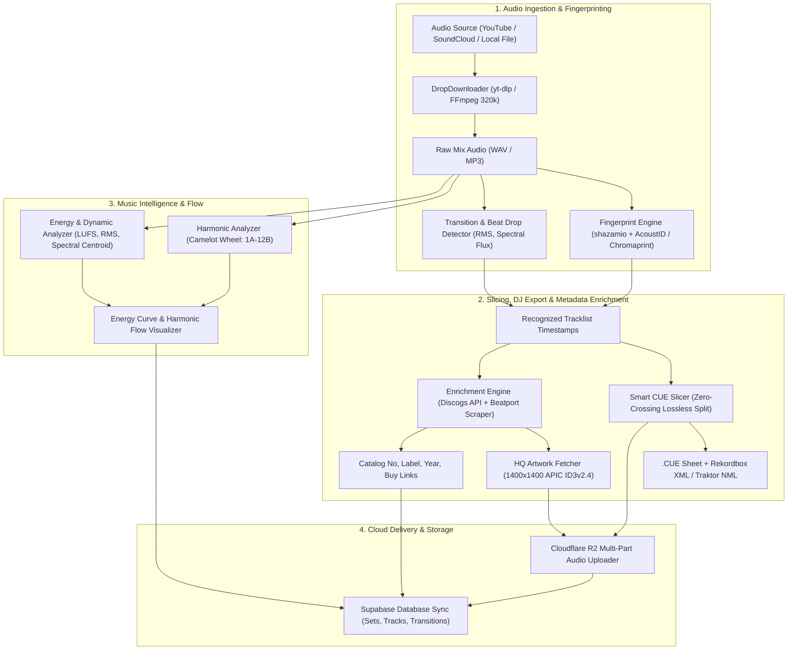

# 💧 DROP AGENT — Technical Evolution Roadmap

> **Documento di Architettura e Roadmap Evolutiva**  
> **Ruolo**: Lead Architect — Drop Agent & Drops Music Intelligence  
> **Versione**: `2.0.0-PROPOSAL`  
> **Data**: Agosto 2026  
> **Destinazione**: `drops-agent/` (Core Engine) & `workspace/00_Roadmap/` (System Architecture)

---

## 📑 Indice dei Contenuti
1. [Visione & Obiettivi Architetturali](#1-visione--obiettivi-architetturali)
2. [Architettura Generale del Sistema](#2-architettura-generale-del-sistema)
3. [Dettaglio delle Milestone Evolutive](#3-dettaglio-delle-milestone-evolutive)
   - [Milestone 1: Audio Fingerprinting & Blind Track Recognition](#milestone-1-audio-fingerprinting--blind-track-recognition)
   - [Milestone 2: Smart CUE Splitting & Rekordbox/Traktor Export](#milestone-2-smart-cue-splitting--rekordboxtraktor-export)
   - [Milestone 3: Discogs & Beatport Metadata & Artwork Enrichment](#milestone-3-discogs--beatport-metadata--artwork-enrichment)
   - [Milestone 4: Direct Cloudflare R2 & Supabase Ingestion](#milestone-4-direct-cloudflare-r2--supabase-ingestion)
   - [Milestone 5: Energy Curve & Harmonic Flow Visualizer](#milestone-5-energy-curve--harmonic-flow-visualizer)
   - [Milestone 6: Autonomous AI Crate Digger Mode](#milestone-6-autonomous-ai-crate-digger-mode)
4. [Schema Dati & Modelli di Persistenza (Supabase / Postgres)](#4-schema-dati--modelli-di-persistenza)
5. [Stack Tecnologico & Dipendenze](#5-stack-tecnologico--dipendenze)
6. [Matrice di Priorità, Dipendenze e Timeline](#6-matrice-di-priorità-dipendenze-e-timeline)
7. [Strategie di Resilienza, Fallback e QA](#7-strategie-di-resilienza-fallback-e-qa)

---

## 1. Visione & Obiettivi Architetturali

**Drop Agent** nasce come braccio autonomo di Music Intelligence, Audio Ingestion e DJ Curation dell'ecosistema **Drops**. La sua missione è trasformare qualsiasi sorgente audio non strutturata (DJ mix continui, registrazioni radio, live set su YouTube/SoundCloud, release discografiche) in un catalogo musicale di altissima qualità, arricchito con:
- Identificazione precisa delle tracce (anche in assenza di tracklist testuale).
- Metadati discografici professionali (Discogs, Beatport, MusicBrainz).
- Analisi armonica (Camelot Wheel), BPM ed energia acustica.
- Esportazione nativa per i principali ecosistemi DJ (Pioneer Rekordbox, Native Instruments Traktor, Engine DJ, CUE sheets).
- Ingestion automatica nel cloud storage (Cloudflare R2) e nel database relazionale (Supabase) della piattaforma web Drops.

```
┌─────────────────────────────────────────────────────────────────────────────┐
│                              DROP AGENT ENGINE                              │
│                                                                             │
│   [ Raw Stream / Set ] ──► [ Blind Audio Recognition ] ──► [ Track Slicing ]│
│                                    │                               │        │
│   [ DJ Harmonic Analysis ] ◄───────┴───────► [ Metadata Enrichment ]        │
│          │                                         │                        │
│          ▼                                         ▼                        │
│   [ DJ Cues / Rekordbox XML ]               [ Cloudflare R2 & Supabase ]    │
└─────────────────────────────────────────────────────────────────────────────┘
```

---

## 2. Architettura Generale del Sistema

L'architettura di Drop Agent è modulare e guidata da pipeline asincrone, progettata per essere eseguita sia come **CLI autonoma ad alte prestazioni**, sia come **worker di background / subagent** invocabile dal backend di Drops.



---

## 3. Dettaglio delle Milestone Evolutive

---

### Milestone 1: Audio Fingerprinting & Blind Track Recognition
> **Obiettivo**: Riconoscere automaticamente tutte le tracce presenti in un DJ set o mix continuous, anche quando la descrizione del video o i metadati non contengono alcuna tracklist testuale.

#### Componenti Chiave
1. **Shazamio Async Sliding-Window Engine**:
   - Analisi a finestra scorrevole sul file audio continuo (finestre di campionamento da 10-15 secondi ogni 60-90 secondi lungo l'intero set).
   - Rate limiting adattivo e retry asincrono per l'API Shazam.
   - Algoritmo di clustering per unire rilevamenti consecutivi appartenenti alla stessa traccia e scartare falsi positivi nei passaggi di mixaggio.

2. **AcoustID & Chromaprint Fallback**:
   - Estrazione di impronte acustiche locali tramite `fpcalc` (Chromaprint).
   - Interrogazione del database MusicBrainz / AcoustID in caso di tracce underground o non catalogate su Shazam.

3. **Transition & Beat Drop Detection Engine**:
   - Analisi del flusso spettrale (*spectral flux*) e del calo RMS per individuare i punti di transizione tipici del mixaggio DJ (fade-in, fade-out, tagli EQ su basse/medie frequenze).
   - Allineamento dei confini di traccia sui transienti di beat drop più vicini per ottenere un cue marker perfettamente a tempo.

#### Deliverable Tecnici
- `drops-agent/fingerprinting/shazam_recognizer.py`
- `drops-agent/fingerprinting/acoustid_recognizer.py`
- `drops-agent/fingerprinting/transition_detector.py`
- Output arricchito con `confidence_score` (0.0 - 1.0) e `timestamp_offset_seconds`.

---

### Milestone 2: Smart CUE Splitting & Rekordbox/Traktor Export
> **Obiettivo**: Generare file CUE standardizzati e file di configurazione per i principali software/hardware DJ professionali, consentendo sia il taglio lossless delle singole tracce che l'importazione diretta su chiavette USB per CDJ.

#### Componenti Chiave
1. **CUE Sheet Generator (Red Book Standard)**:
   - Creazione di file `.cue` conformi con campi `PERFORMER`, `TITLE`, `INDEX 01 mm:ss:ff` (75 frames per secondo).
   - Generazione di file `.m3u8` estesi con tag `#EXTINF` completi.

2. **Lossless / Zero-Crossing Audio Slicer**:
   - Taglio del mix continuo in singoli file MP3/FLAC tramite FFmpeg senza ricodifica (`-c copy`) o con ricodifica trasparente a 320kbps con dissolvenze minime (50ms) sui punti di giunzione.
   - *Zero-Crossing Snapping*: posizionamento del taglio sul passaggio per lo zero dell'onda sonora per evitare click o artefatti digitali.

3. **Rekordbox & Traktor XML / NML Bridge**:
   - Generazione del file `rekordbox.xml` (`DJ_PLAYLISTS` format) contenente Beatgrid calcolato, Camelot Key, BPM esatto e **Hot Cue / Memory Cue** posizionati all'inizio di ogni traccia.
   - Generazione di `traktor.nml` (Native Instruments Collection format) con griglia beat e cue point esportabili.

#### Deliverable Tecnici
- `drops-agent/exporters/cue_generator.py`
- `drops-agent/exporters/audio_slicer.py`
- `drops-agent/exporters/rekordbox_exporter.py`
- `drops-agent/exporters/traktor_exporter.py`

---

### Milestone 3: Discogs & Beatport Metadata & Artwork Enrichment
> **Obiettivo**: Elevare la qualità dei metadati al livello dei massimi standard dell'industria discografica, garantendo cover art ad altissima risoluzione e riferimenti accurati a etichette, numeri di catalogo e formati fisici/digitali.

#### Componenti Chiave
1. **Multi-Source Metadata Pipeline**:
   - Interrogazione in cascata: **Discogs API** (con token autenticato e pacing a 60 req/min) ➔ **Beatport API/Scraper** ➔ **MusicBrainz**.
   - Normalizzazione e deduplicazione con algoritmi di *Fuzzy String Matching* (Levenshtein Distance + Token Sort Ratio) per risolvere discrepanze come "Original Mix", "Club Edit", remixer o collaborazioni.

2. **Ultra-HD Cover Art Ingestion (1400x1400px+)**:
   - Recupero delle copertine originali delle release da Discogs Primary Images o Beatport High-Res CDN.
   - Ridimensionamento ottimizzato e inserimento nei tag ID3v2.4 (frame `APIC`) e Vorbis Comments per FLAC.

3. **Extended DJ & Vinyl Cataloging**:
   - Inserimento metadati avanzati: `Catalog Number`, `Record Label`, `Original Release Year`, `Style / Subgenre`, `Country of Origin`, `Format` (Vinyl, 12", File).
   - Inclusione di link diretti per l'acquisto su Bandcamp, Discogs Marketplace e Beatport nel file `TRACKLIST.md` e nel DB.

#### Deliverable Tecnici
- `drops-agent/enrichment/discogs_client.py`
- `drops-agent/enrichment/beatport_client.py`
- `drops-agent/enrichment/artwork_manager.py`
- `drops-agent/enrichment/metadata_tagger.py` (Mutagen / ID3v2.4 integration)

---

### Milestone 4: Direct Cloudflare R2 & Supabase Ingestion
> **Obiettivo**: Connettere l'output di Drop Agent direttamente all'infrastruttura Cloud di Drops, consentendo il backup automatico dei file audio su Cloudflare R2 e la sincronizzazione immediata delle collezioni nel database PostgreSQL di Supabase.

#### Componenti Chiave
1. **Cloudflare R2 S3-Compatible Multi-Part Uploader**:
   - Upload parallelo e resiliente dei file audio (full mix + single tracks) e degli artwork HQ.
   - Gestione di hash SHA-256 e MIME types per lo streaming audio via Edge CDN Cloudflare Workers.
   - Generazione di URL pubblici / presigned ottimizzati per il web player di Drops.

2. **Supabase Relational Ingestion Engine**:
   - Inserimento e aggiornamento atomico nelle tabelle: `dj_sets`, `tracks`, `labels`, `artists`, `set_tracks`, `harmonic_transitions`.
   - Popolazione dei dati DJ (BPM, Camelot Key, Durata, Hot Cues, Waveform Peaks).

3. **One-Click Sync CLI & Webhook Trigger**:
   - Flag CLI `--upload-cloud` e `--sync-db` per eseguire l'ingestion completa senza interventi manuali.
   - Endpoint webhook di notifica per invalidare la cache del frontend Astro/React e aggiornare istantaneamente la piattaforma web Drops.

#### Deliverable Tecnici
- `drops-agent/cloud/r2_storage.py` (Boto3 / aioboto3 async client)
- `drops-agent/cloud/supabase_sync.py` (Supabase Python SDK / PostgREST)
- `drops-agent/cloud/models.py` (Pydantic data schemas)

---

### Milestone 5: Energy Curve & Harmonic Flow Visualizer
> **Obiettivo**: Fornire una rappresentazione visiva e analitica avanzata della dinamica e del flusso armonico del set, permettendo ai DJ e ai curatori di comprendere la progressione dell'energia e la compatibilità tonale delle transizioni.

#### Componenti Chiave
1. **Dynamic Energy & Loudness Curve**:
   - Calcolo continuo dell'energia RMS su finestre temporali da 1 secondo.
   - Analisi di volume integrato e dinamica **EBU R128 (LUFS)**.
   - Rilevamento dello *Spectral Centroid* (brillantezza/densità frequenziale) per distinguere breakdown d'atmosfera da drop ad alto impatto.

2. **Camelot Harmonic Transition Matrix**:
   - Valutazione della compatibilità armonica tra tracce consecutive secondo le regole della Camelot Wheel:
     - **Energy Boost (+1 / +2)**: es. 8A ➔ 9A o 8A ➔ 10A.
     - **Harmonious Blend (Same / Relative)**: es. 8A ➔ 8A o 8A ➔ 8B.
     - **Energy Drop / Mood Relax (-1)**: es. 8A ➔ 7A.
     - **Key Clash / Tensione Cromatica**: salti incompatibili segnalati visivamente con alert.

3. **Interactive Set Flow Visualizer (SVG / JSON / React Component)**:
   - Generazione di grafici vettoriali interattivi (SVG e JSON compatibili con React/D3/Chart.js nel frontend).
   - Esportazione di un'infografica ad alta risoluzione da salvare nella cartella del set e includere in `TRACKLIST.md`.

```
Set Energy & Camelot Harmonic Flow Diagram (Esempio Concettuale):
100% |                                      ╭─────╮ (Drop 3: 9A - Peak)
     |            ╭─────╮ (Drop 1: 8A)      │     │
 50% |   ╭───╮    │     │          ╭───╮    │     │
     |   │   ╰────╯     ╰──────────╯   ╰────╯     ╰──────────
  0% └───┴────────────────────────────────────────────────────► Time (00:00 - 60:00)
      Track 1 (8A)   Track 2 (8A)  Track 3 (8B)  Track 4 (9A)
```

#### Deliverable Tecnici
- `drops-agent/analysis/energy_analyzer.py`
- `drops-agent/analysis/harmonic_flow.py`
- `drops-agent/visualization/flow_chart_generator.py`

---

### Milestone 6: Autonomous AI Crate Digger Mode
> **Obiettivo**: Trasformare Drop Agent in un agente proattivo e autonomo di ricerca musicale ("Crate Digger"), capace di scandagliare il web, canali YouTube di culto, discografie di label su Discogs e feed Bandcamp per comporre selezioni coerenti su parametri DJ specifici.

#### Componenti Chiave
1. **Autonomous Discovery Agents**:
   - *Channel & Label Crawler*: monitoraggio di canali YouTube specializzati nell'elettronica (es. Houseum, Mos Deep, HATE, Defected, Waxtefacts), pagine Bandcamp e cataloghi di etichette del Grafo Drops.
   - Estrazione di snippet e anteprime audio per l'analisi preliminare.

2. **Goal-Driven Selection & Harmonic Matching Engine**:
   - Supporto a query e prompt complessi definiti dall'utente, ad esempio:
     > *"Trova e scarica 15 tracce Deep House / Dub Techno tra 122 e 125 BPM in tonalità 8A o 9A con mood scuro e ritmiche calde per un warm-up set."*
   - Filtraggio automatico per coerenza di genere, BPM, chiave armonica e assenza di duplicati nella libreria locale.

3. **Automated Quality Gate & Library Organization**:
   - Verifica automatica del bitrate audio (minimo 320kbps reale).
   - Generazione automatica di una nuova Crate strutturata in `data/audio/AI-Crates/<Crate-Name>/` con playlist, CUE e sincronizzazione Supabase/R2.

#### Deliverable Tecnici
- `drops-agent/digger/crate_agent.py`
- `drops-agent/digger/channel_crawler.py`
- `drops-agent/digger/recommendation_heuristics.py`
- `drops-agent/digger/quality_gate.py`

---

## 4. Schema Dati & Modelli di Persistenza

Per garantire la perfetta integrazione con il backend di Drops e Supabase, Drop Agent produrrà e sincronizzerà le seguenti entità nel database PostgreSQL:

```sql
-- Tabella DJ Sets / Mixes
CREATE TABLE public.dj_sets (
    id UUID PRIMARY KEY DEFAULT gen_random_uuid(),
    title VARCHAR(255) NOT NULL,
    curator_or_dj VARCHAR(255),
    genre VARCHAR(100) NOT NULL,
    source_url TEXT,
    duration_seconds INTEGER,
    average_bpm NUMERIC(5, 2),
    initial_key VARCHAR(10),
    energy_curve JSONB, -- Array di punti RMS/LUFS nel tempo
    r2_audio_url TEXT,
    r2_artwork_url TEXT,
    created_at TIMESTAMPTZ DEFAULT now()
);

-- Tabella Singole Tracce nel Catalogo
CREATE TABLE public.tracks (
    id UUID PRIMARY KEY DEFAULT gen_random_uuid(),
    title VARCHAR(255) NOT NULL,
    artist VARCHAR(255) NOT NULL,
    album VARCHAR(255),
    genre VARCHAR(100),
    style VARCHAR(100),
    record_label VARCHAR(255),
    catalog_number VARCHAR(100),
    release_year INTEGER,
    bpm NUMERIC(5, 2),
    musical_key VARCHAR(20),
    camelot_key VARCHAR(5),
    energy_rating INTEGER, -- 1-10
    discogs_id INTEGER,
    beatport_id VARCHAR(100),
    r2_audio_url TEXT,
    r2_artwork_url TEXT,
    buy_links JSONB,
    created_at TIMESTAMPTZ DEFAULT now()
);

-- Tabella di Relazione Set ➔ Tracce con Marker Temporali
CREATE TABLE public.set_tracks (
    id UUID PRIMARY KEY DEFAULT gen_random_uuid(),
    set_id UUID REFERENCES public.dj_sets(id) ON DELETE CASCADE,
    track_id UUID REFERENCES public.tracks(id) ON DELETE SET NULL,
    track_number INTEGER NOT NULL,
    start_time_seconds NUMERIC(8, 2) NOT NULL,
    end_time_seconds NUMERIC(8, 2),
    transition_type VARCHAR(50), -- e.g., 'smooth_blend', 'drop_cut', 'crossfade'
    harmonic_delta VARCHAR(20), -- e.g., '+1A (Energy Boost)', '0 (Same Key)'
    confidence_score NUMERIC(4, 3)
);
```

---

## 5. Stack Tecnologico & Dipendenze

| Modulo / Funzionalità | Librerie & Strumenti | Note Architetturali |
| :--- | :--- | :--- |
| **Download & Demuxing** | `yt-dlp`, `ffmpeg`, `ffprobe` | Download ad alta fedeltà, estrazione stream PCM mono/stereo |
| **Blind Recognition** | `shazamio`, `pyacoustid`, `fpcalc` | Riconoscimento Shazam asincrono + Chromaprint/AcoustID fallback |
| **Analisi Audio & Armonica** | `librosa`, `scipy`, `numpy`, `soundfile` | Algoritmo Krumhansl-Schmuckler, FFT, Chromagram, onset detection |
| **Tagging & Metadata** | `mutagen`, `musicbrainzngs` | ID3v2.4, Vorbis Comments, APIC HD embedding, sanitizzazione tag |
| **Discogs & Beatport** | `requests`, `aiohttp`, `beautifulsoup4` | Client con cache locale, rate limiting a 60 req/min e token auth |
| **Export DJ** | `xml.etree.ElementTree`, CUE engine interno | Generazione XML Rekordbox 5/6/7, NML Traktor Pro, CUE Red Book |
| **Cloud & Persistenza** | `boto3`, `aioboto3`, `supabase-py` | Multi-part upload Cloudflare R2 (S3 API), PostgREST client |
| **Visualizzazione Dati** | `matplotlib`, `svgwrite`, JSON output | Generazione curve di energia vettoriali e matrici di flusso armonico |

---

## 6. Matrice di Priorità, Dipendenze e Timeline

```mermaid
gantt
    title Drop Agent — Delivery Plan
    dateFormat  YYYY-MM-DD
    section Core Recognition
    M1: Audio Fingerprinting & Blind Recognition  :active, m1, 2026-09-01, 14d
    section DJ Infrastructure
    M2: Smart CUE Splitting & Rekordbox Export    :m2, after m1, 12d
    section Metadata & Artwork
    M3: Discogs & Beatport Enrichment            :m3, after m1, 10d
    section Cloud & Platform Sync
    M4: Cloudflare R2 & Supabase Ingestion       :m4, after m2, 12d
    section Music Intelligence
    M5: Energy Curve & Harmonic Flow Visualizer  :m5, after m3, 10d
    section Autonomous AI
    M6: Autonomous AI Crate Digger Mode          :m6, after m4 m5, 20d
```

### Tabella delle Priorità

| Milestone | Nome Funzionalità | Priorità | Dipendenze | Impatto sul Valore |
| :---: | :--- | :---: | :---: | :--- |
| **M1** | Audio Fingerprinting & Blind Recognition | **P0 (Critica)** | — | Abilita la catalogazione di set senza tracklist manuale |
| **M2** | Smart CUE Splitting & Rekordbox/Traktor Export | **P0 (Critica)** | M1 | Workflow essenziale per DJ e preparazione live |
| **M3** | Discogs & Beatport Metadata & Artwork HQ | **P1 (Alta)** | M1 | Qualità museale del catalogo e metadati discografici |
| **M4** | Cloudflare R2 & Supabase Ingestion | **P1 (Alta)** | M2, M3 | Connessione diretta tra motore desktop e web platform |
| **M5** | Energy Curve & Harmonic Flow Visualizer | **P2 (Media)** | M1 | Comprensione visiva delle transizioni e del mix flow |
| **M6** | Autonomous AI Crate Digger Mode | **P2 (Innovazione)**| M4, M5 | Scoperta autonoma proattiva guidata da AI |

---

## 7. Strategie di Resilienza, Fallback e QA

1. **Gestione Fallimenti di Riconoscimento Tracce (Blind Recognition)**:
   - Se Shazamio non riconosce un segmento (traccia unreleased / promo), il sistema passa automaticamente a Chromaprint/AcoustID.
   - In caso di mancata identificazione totale, la traccia viene etichettata come `Unknown Track (Track #)` preservando BPM e tonalità stimati con precisione analitica.

2. **Resilienza API Discogs / Beatport**:
   - Cache persistente su disco (`discogs-cache/`) con chiave hash MD5 per evitare richieste duplicate.
   - Pacing rigoroso delle chiamate (massimo 1 richiesta al secondo) e gestione del backoff esponenziale con codice HTTP `429 Too Many Requests`.

3. **Integrità Audio e Zero-Loss Export**:
   - Tutti i processi di slicing verificano il checksum MD5/SHA256 prima e dopo l'elaborazione.
   - Le transizioni vengono verificate per escludere clipping o discontinuità di fase.

4. **Transazioni Atomiche per l'Ingestion Cloud**:
   - In caso di errore durante l'upload su Cloudflare R2 o l'inserimento in Supabase, il sistema esegue un rollback locale cancellando i file orfani temporanei e registrando l'evento in `~/.drops/logs/drop_agent.log`.

---

> **Approvato dall'Architettura di Sistema**  
> *Drops Core Engineering Team — 2026*
